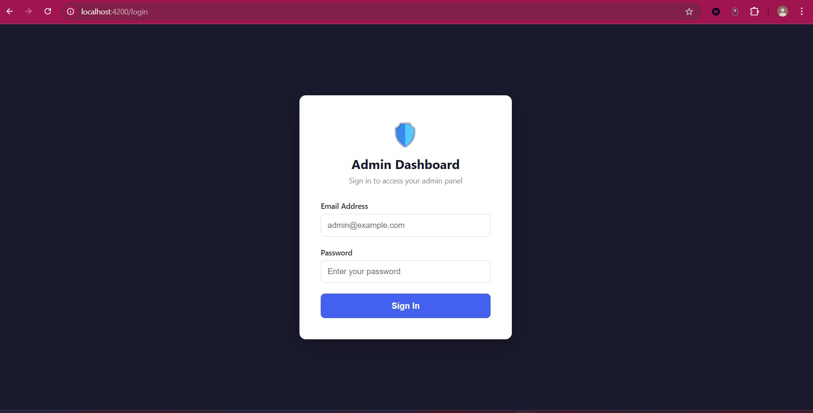
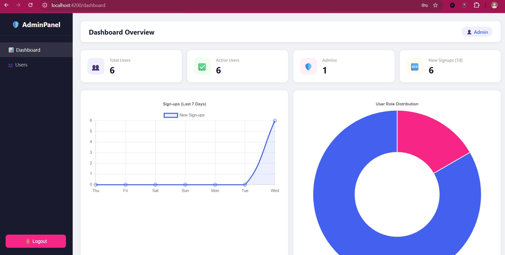
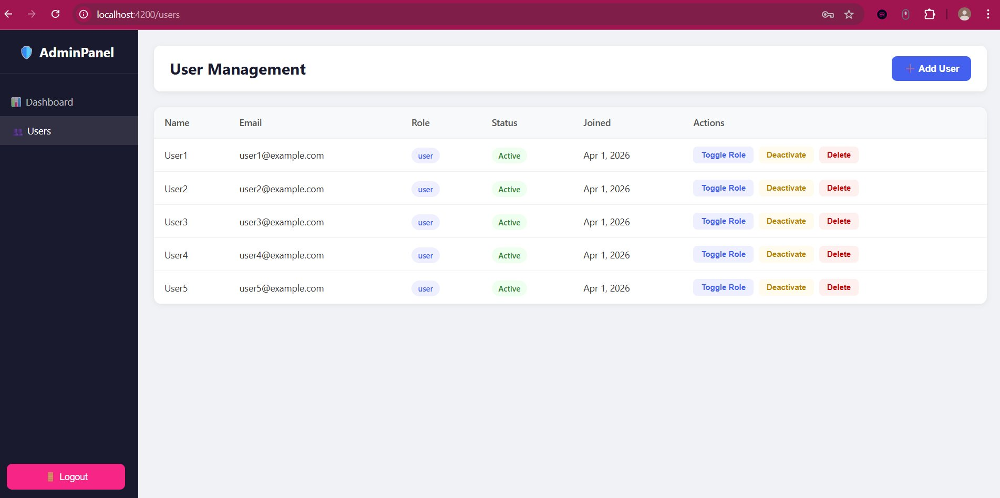
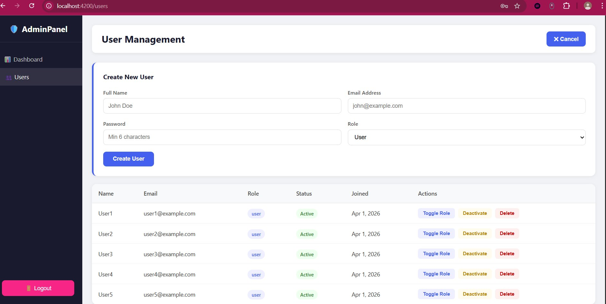

# 🛡️ MEAN Stack Admin Dashboard

A full-stack **Admin Dashboard** built with the **MEAN Stack** (MongoDB, Express.js, Angular, Node.js).  
Features JWT authentication, role-based access control, user management, and real-time analytics charts.


---

## 📸 Screenshots

### 🔐 Login Page


### 📊 Dashboard Overview


### 👥 User Management


### ➕ Create New User


---

## ✨ Features

- 🔐 JWT Login (Admin only access)
- 📊 Dashboard with live analytics charts (Line + Doughnut)
- 👥 User Management — Create, Update Role, Activate/Deactivate, Delete
- 🛡️ Role-based route protection (Admin vs User)
- 📱 Responsive UI (works on mobile and desktop)

---

## 🖥️ Tech Stack

| Layer | Technology |
|-------|-----------|
| Frontend | Angular 17 (Standalone Components) |
| Backend | Node.js + Express.js |
| Database | MongoDB + Mongoose |
| Auth | JWT (JSON Web Tokens) + bcryptjs |
| Charts | Chart.js |

---

## 📁 Project Structure

```
mean-admin-dashboard/
├── backend/
│   ├── server.js           ← App entry point
│   ├── .env                ← Environment variables (never commit this!)
│   ├── seed.js             ← Creates first admin user
│   ├── config/
│   │   └── db.js           ← MongoDB connection
│   ├── models/
│   │   └── User.js         ← User schema
│   ├── middleware/
│   │   └── authMiddleware.js ← JWT + role checks
│   └── routes/
│       ├── authRoutes.js   ← Login & Register
│       ├── userRoutes.js   ← User CRUD
│       └── analyticsRoutes.js ← Dashboard data
│
└── frontend/
    └── src/app/
        ├── services/
        │   ├── auth.service.ts   ← Login, logout, token storage
        │   └── api.service.ts    ← All HTTP calls to backend
        ├── guards/
        │   └── auth.guard.ts     ← Protect routes
        ├── login/                ← Login page
        ├── dashboard/            ← Dashboard with charts
        └── users/                ← User management table
```

---

## ⚙️ Prerequisites

Make sure these are installed before starting:

- [Node.js](https://nodejs.org) (v18 or higher)
- [MongoDB](https://www.mongodb.com/try/download/community) (local) OR [MongoDB Atlas](https://www.mongodb.com/atlas) (free cloud)
- Angular CLI

```bash
npm install -g @angular/cli
```

---

## 🚀 Getting Started

### 1. Clone the Repository

```bash
git clone https://github.com/your-username/mean-admin-dashboard.git
cd mean-admin-dashboard
```

### 2. Setup Backend

```bash
cd backend
npm install
```

Create a `.env` file inside the `backend/` folder:

```env
MONGO_URI=mongodb://localhost:27017/admin_dashboard
JWT_SECRET=yourSuperSecretKey123
PORT=5000
```

> 💡 If using MongoDB Atlas, replace `MONGO_URI` with your Atlas connection string.

### 3. Seed the Database (Create Admin User)

```bash
node seed.js
```

This creates:
- **Admin:** `admin@gmail.com` / `admin123`
- **5 test users:** `user1@example.com` to `user5@example.com` / `user123`

### 4. Start the Backend

```bash
node server.js
```

You should see:
```
✅ MongoDB connected successfully!
🚀 Server running at http://localhost:5000
```

### 5. Setup & Start Frontend

Open a **new terminal**:

```bash
cd frontend
npm install
npm install chart.js
ng serve
```

Open your browser at **http://localhost:4200**

---

## 🔐 Login Credentials

| Role | Email | Password |
|------|-------|----------|
| Admin | admin@gmail.com | admin123 |
| Test User | user1@example.com | user123 |

> ⚠️ Only admin accounts can access the dashboard. Regular users are blocked at login.

---

## 📡 API Endpoints

| Method | Endpoint | Auth | Description |
|--------|----------|------|-------------|
| POST | `/api/auth/login` | ❌ Public | Login and get JWT token |
| POST | `/api/auth/register` | ✅ Admin | Create a new user |
| GET | `/api/users` | ✅ Admin | Get all users |
| PUT | `/api/users/:id` | ✅ Admin | Update role or status |
| DELETE | `/api/users/:id` | ✅ Admin | Delete a user |
| GET | `/api/analytics/overview` | ✅ Admin | Total users, admins, signups |
| GET | `/api/analytics/signups` | ✅ Admin | 7-day signup trend |
| GET | `/api/analytics/roles` | ✅ Admin | Admin vs user count |

---

## 🐛 Troubleshooting

| Problem | Fix |
|---------|-----|
| CORS error in browser | Make sure backend has `cors({ origin: 'http://localhost:4200' })` in `server.js` |
| 401 Unauthorized | Your token expired — log out and log in again |
| MongoDB connection failed | Check your `MONGO_URI` in `.env` file |
| `provideHttpClient` error | Add `provideHttpClient()` to `app.config.ts` |
| Charts crash on navigation | Already fixed using `ngOnDestroy` to destroy chart instances |
| Duplicate key error on seed | Already fixed — `seed.js` clears users before inserting |
| Button stuck on "Signing in..." | Already fixed — `isLoading = false` added to error handler |
| `require is not defined` error | Do NOT use top-level `await` in seed.js — use `seed().catch(console.error)` |

---

## 🔒 Security Notes

- Passwords are hashed using **bcryptjs** (never stored as plain text)
- JWT tokens expire after **7 days**
- The `/register` route is **admin-protected** — only logged-in admins can create users
- Route guards on frontend prevent unauthorized page access
- **Never commit your `.env` file** — add it to `.gitignore`

---

## 📄 .gitignore

Make sure your `.gitignore` includes:

```
backend/.env
backend/node_modules/
frontend/node_modules/
```

---

## 🙌 Acknowledgements

- [Angular](https://angular.io)
- [Chart.js](https://www.chartjs.org)
- [MongoDB](https://www.mongodb.com)
- [Express.js](https://expressjs.com)
